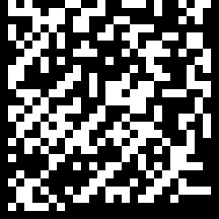

# pyxpiral
Dirty cheap pseudo-[DataMatrix](https://en.wikipedia.org/wiki/Datamatrix) (de)coder. Turns any ascii string into a 2d bitmap or gif and vice-versa.

[](https://travis-ci.org/elcodedocle/pyxpiral)

## Usage

```
$python pyxpiral.py
usage: pyxpiral.py [-h] (--encode ENCODE | --decode DECODE) [--scale SCALE]
                   [--bg-color BG_COLOR] [--bits-color BITS_COLOR]
                   [--step-size STEP_SIZE] [--rotation-step ROTATION_STEP]
                   [--frame-duration FRAME_DURATION] [--loops LOOPS]
                   [--output-filename OUTPUT_FILENAME]
```


### Example
All free pseudo-DataMatrix. Get yours today:
```
python pyxpiral.py --encode "Never go full electro (AKA Keep calm and read bits cycling in squared spirals)." --output ngfeog.bmp
Generated ngfeog.bmp and ngfeog.bmp.gif
```

ngfeog.bmp:



ngfeog.bmp.gif:


If you want to decode the message from the image:
```
python pyxpiral.py --decode ngfeog.bmp
Decoded ngfeog.bmp: Never go full electro (AKA Keep calm and read bits cycling in squared spirals).
```

Donations for this micro-project will be reinvested on local animal shelter: https://goo.gl/fvWmXL

Enjoy!
